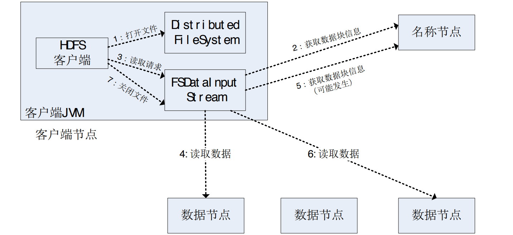

《大数据技术原理与应用》

# 第一章 大数据概述

## 出现大数据时代的原因

1. 信息科技为大数据时代提供技术支撑
    - 存储设备容量不断增加（信息存储）
    - CPU处理能力大幅提升（信息处理）
    - 网络带宽不断增加（信息传输）
2. 数据产生方式的变革促成大数据时代的来临
    - 运营式系统阶段 -> 用户原创内容阶段 -> 感知式系统阶段

## 大数据的四个特点

1. 数据量大
    - 大数据摩尔定律：每人类社会产生的数据每两年增加一倍
    - 摩尔定律：CPU处理速度每18个月提高一倍
2. 数据类型繁多
    - 结构化数据占10%
    - 非结构数据占90%
3. 处理速度快
    - 一秒定律：数据处理和分析的速度要达到秒级响应
4. 价值密度低
5. 可视化和精准性

## 大数据的影响

1. 科学研究
    - 实验科学
    - 理论科学
    - 计算科学（提出可能理论，收集数据，通过计算进行验证）
    - 数据密集型科学（收集大量数据，通过计算得出之前未知的结论）
2. 思维方式
    - 出自《大数据时代：生活、工作和思维的大变革》
        - 全样而非抽样
        - 效率而非精确
        - 相关而非因果
    - 出自《为数据而生：大数据创新实践》
        - 统计呈现洞见
        - 关联蕴含价值
        - 预测指导决策
        - 大数据的外部性
3. 社会发展
4. 就业市场
5. 人才培养

## 大数据的计算模式

1. 批处理计算
    - 针对大规模数据的批量处理
2. 流计算
    - 针对流数据的实时计算
3. 图计算
    - 针对大规模图结构数据的处理
4. 查询分析计算
    - 大规模数据的存储管理和查询分析

## 大数据与热门技术的关系

- 云计算
    - 服务模式
        1. 软件即服务 SaaS
        2. 平台即服务 PaaS
        3. 基础设施即服务 IaaS
    - 类型
        1. 公有云
        2. 私有云
        3. 混合云
    - 关键技术
        1. 虚拟化
        2. 分布式存储
        3. 分布式计算
        4. 多租户
- 物联网
    - 技术架构
        1. 感知层
        2. 网络层
        3. 处理层
        4. 应用层
    - 关键技术
        1. 识别和感知技术
            - 二维码
            - RFID
            - 传感器
        2. 网络与通信技术
            - 近距离通信
            - 远距离通信
        3. 数据挖掘和融合技术
    - 产业链
        - 核心感应器件提供商 -> 感知层末端设备提供商 -> 网络提供商 -> 软件与行业解决方案提供商 -> 系统集成商 -> 运营及服务提供商
- 大数据与云计算和物联网的关系
    1. 大数据与云计算
        - 大数据为云计算提供用武之地
        - 云计算为大数据提供了技术基础
    2. 大数据与物联网
        - 大数据技术为物联网数据分析提供支持
        - 物联网是大数据的重要来源
    3. 物联网和云计算
        - 物联网为云计算技术提供了广阔的应用空间
        - 云计算为物联网提供海量数据存储能力

    
- 与人工智能的关系
    - “大数据为人工智能提供了基础的材料，云计算为人工智能提供了基础的存储和计算的范例，人工智能把大数据或云计算变成了改变我们现实生活的不同的场景。”（与物联网类似）

# 第二章 大数据处理架构Hadoop

## Hadoop概述

- 历史
    - Hadoop最初是由Apache Lucene项目的创始人Dong Cutting开发的文本搜索库
    - Hadoop源自始于2002年的Apache Nutch项目，一个开源的网络搜索引擎并且也是Lucene项目的一部分
- 核心
    - HDFS（Hadoop分布式文件系统）
        - 针对GFS（谷歌文件系统）的开源实现
    - MapReduce
        - 针对谷歌MapReduce的开源实现

## Hadoop生态系统

- **HDFS**（分布式文件系统）
    - 针对GFS的开源实现
    - 把硬件故障作为常态考虑
    - 实现以流的形式访问文件系统中的数据
- **HBase**（分布式数据库）
    - 列式数据库
    - 针对谷歌BigTable的开源实现
    - 一般采用HDFS作为底层数据存储系统
- **MapReduce**（分布式计算框架）
    - 针对谷歌MapReduce的开源实现
    - 编程模型，用于大规模数据集的并行计算
- **Hive**（数据仓库）
    - 基于Hadoop的数据仓库工具
    - 用于对Hadoop文件中的数据集进行数据整理、特殊查询和分析存储
- **Pig**（数据流处理）
    - 数据流语言和运行环境
    - 查询大型半结构化数据集
- **Mahout**（数据挖掘库）
    - Apache软件基金会旗下开源项目
    - 提供机器学习领域经典算法的实现
- **ZooKeeper**（分布式协作服务）
    - 针对谷歌Chubby的开源实现
    - 高效且可靠的协同工作系统，用于构建分布式应用
- **Flume**（日志收集）
    - Cloudera提供的分布式海量日志采集、聚合和创数的系统
    - 有对日志数据进行简单处理的能力
- **Sqoop**（数据库ETL）
    - 用于在Hadoop和关系数据库之间交换数据
- **Ambari**（安装、部署、配置和管理工具）
    - 基于Web的工具
    - 支持Apache Hadoop集群的安装、部署、配置和管理

# 第三章 分布式文件系统HDFS
## 分布式文件系统
- 基本概念
    - 分布式文件系统是一种通过网络实现文件在多台主机上进行分布式存储的文件系统
- 结构
    - 逻辑结构
        - 集群中的计算机节点存放在机架上，每个机架可以存放8~64个节点，同一机架上的不同节点之间通过网络互联，多个不同机架之间采用另一级网络或交换机互联
    - 物理结构
        

## HDFS
- 相关概念
    - **块**
        - 默认一个块64MB，远大于普通文件系统
        - 文件被拆分为多个块，每个块作为独立单位进行存储
        - 优点：
            1. 支持大规模文件存储
            2. 简化系统设计
            3. 适合数据备份
    - **名称节点**（NameNode）
        - 负责管理分布式文件系统的命名空间
        - 记录了每个文件中各个块所在的数据节点的位置信息
        - **FsImage**：用于维护文件系统树以及文件中所有的文件和文件夹的元数据，不记录文件包含哪些块以及每个块存储在哪个数据节点
        - **EditLog**：记录了所有针对文件的创建、删除、重命名等操作
        - 在启动时会将FsImage内容加载到内存中，然后执行EditLog文件中的操作，使内存中的数据保持最新，此时处于*安全模式*，只提供读操作

        
    - **数据节点**（DataNode）
        - 负责数据的存储和读取
        - 根据客户端或名称节点的调度进行数据的存储和检索
        - 向名称节点定期发送自己所存储块的列表信息
        - 数据保存在各自节点本地Linux文件系统中
    - **第二名称节点**（SecondaryNameNode）
        - 用于保存名称节点中对HDFS元数据信息的备份
        - 减少名称节点重启的时间

        
- 体系结构
    - 主从结构模型
    - HDFS1.0体系结构中，一个集群仅有一个命名空间，并且只有一个名称节点
    - 通信协议
        - 构建在TCP/IP协议上的
        - 名称节点与数据节点间使用数据节点协议进行交互
        - 名称节点不会主动发起请求，而是响应来自客户端和数据节点的请求
        - 客户端通过可配置的端口向名称节点发起TCP连接，并使用客户端协议与名称节点进行交互
        - 客户端与数据节点通过RPC进行交互
    - 严格来说，客户端不算是HDFS的一部分
    - 唯一名称节点的局限性：
        1. 命名空间的限制
        2. 性能的瓶颈
        3. 隔离问题
        4. 集群的可用性

    
- 存储原理
    - 冗余存储
        - HDFS采用多副本方式对数据进行冗余存储
        - 一个数据块的多个副本会被分布到不同的数据节点上
        - 优点：
            1. 加快数据传输速度
            2. 容易检查数据错误
            3. 保证数据的可靠性
    - 数据存取策略
        - 数据存放
            - 默认的冗余因子是3
            - 步骤：
                1. 根据是否在集群内，本地或者一个空闲的节点存放第一个副本
                2. 第二个副本存放在不同机架上的节点
                3. 第三个副本存放在相同机架上的不同节点
                4. 更多的副本随机挑选节点
        - 数据读取
            - 客户端可以调用API确定自己和数据节点所属的机架ID
            - 客户端从数据节点获得数据块不同副本的位置列表
            - 优先选择相同机架ID的副本读取，如果没有则随机读取
        - 数据复制
            - 流水线复制策略
            - 步骤：
                - 文件存放在本地，分块
                - 每个块向名称节点发起写请求
                - 名称节点根据空闲情况返回一个数据节点列表
                - 向第一个数据节点写数据块，并传递数据列表
                - 第一个数据节点向第二个数据节点写数据，并传递数据列表
                - 以此类推，直至完成
    - 数据错误与恢复
        - 名称节点出错
            - 调用第二名称节点的FsImage和EditLog进行恢复
        - 数据节点出错
            - 接收不到数据节点定期发送的心跳信息后，该节点数据被标记为不可读，不会被发送I/O请求
            - 当数据块的副本数量少于冗余因子时，会启动数据冗余复制，生成新的副本
            - HDFS和其他文件系统最大的区别是，可以调整冗余数据的位置
        - 数据出错
            - 使用md5和sha1对数据块进行校验，如果不正确则重新请求，并向名称节点报告数据有误
- 读写过程
    - 读数据
        1. 客户端输入打开文件命令，DistributedFileSystem创建输入流DFSInputStream
        2. 输入流向名称节点请求开始部分数据块位置，并对名称节点返回的列表根据距离进行排序。并实例化FSDataInputStream，一起返回给客户端
        3. 客户端开始读数据，根据节点排序结果依次连接，直至成功
        4. 读取数据过程，读取完后关闭连接
        5. 输入流DFSInputStream请求下一数据块的位置（取决于是否缓存）
        6. 重复上述操作
        7. 读取完后需要关闭输入流FSDataInputStream

        
    - 写数据
        1. 客户端调用创建文件命令，DistributedFileSystem创建输出流DFSOutputStream
        2. 通过RPC远程调用名称节点，名称节点检查后会在文件系统的命名空间中创建新文件。并实例化FSDataOutputStream，一起返回给客户端
        3. 客户端开始写数据
        4. 文件会被分块为一个个的包，在DFSOutputStream内形成队列，输出流FSDataOutputStream向名称节点申请

        

# 第五章 NoSQL数据库

## 关系数据库无法满足的需求

1. 无法满足海量数据的管理需求
2. 无法满足数据高并发的需求
3. 无法满足高扩展性和高可用性的需求

## 与关系数据库的比较

|对比指标|NoSQL|关系数据库|
|---|---|---|
|数据库原理|部分支持|完全支持|
|数据规模|超大|大|
|数据库模式|灵活|固定|
|查询效率|高效的简单查询，复杂查询性能不尽如人意|快|
|一致性|弱一致性|强一致性|
|数据完整性|很难实现|容易实现|

## 四大类型

- 键值数据库
    - 数据模型：键值对
    - 典型应用：内容缓存
    - 优点：扩展性好、灵活性好、大量写时性能高
    - 缺点：无法结构化存储信息、条件查找效率低
- 列族数据库
    - 数据模型：列族
    - 典型应用：分布式数据存储与管理
    - 优点：查找速度快、可扩展性强、容易进行分布式扩展、复杂性低
    - 缺点：功能较少，大都不支持事务一致性
- 文档数据库
    - 数据模型：版本化的文档
    - 典型应用：存储、索引并管理面向文档的数据或者类似的板结构化数据
    - 优点：性能好、灵活性高、复杂性低、数据结构灵活
    - 缺点：缺乏统一的查询语法
- 图数据库
    - 数据模型：图结构
    - 典型应用：应用于大量复杂、互连接、低结构化的图结构场合
    - 优点：灵活性高、支持复杂的图算法、可用于构建复杂的关系图谱
    - 缺点：复杂性高、只能支持一定的数据规模

## 三大基石

- CAP
    - 含义：
        - Consistency：一致性
        - Availability：可用性
        - Tolerance of Network Partition：分区容忍性
    - CAP理论：一个分布式系统不可能同时满足一致性、可用性和分区容忍性，最多满足两个
    - 设计原则：
        - CA：放弃分区容忍性，最简单做法是将所有内容放到一台机器。例如：传统的关系数据库
        - CP：放弃可用性，在网络分区的时候，受影响的部分无法提供服务
        - AP：放弃数据一致性，选择采用最终一致性
- BASE
    - ACID
        - Atomicity：原子性
        - Consistency：一致性
        - Isolation：隔离性
        - Durability：持久性
    - Basically Available：基本可用，在一部分不可用的情况下，其他部分仍然可用
    - Soft-state：软状态，状态可以有一段时间不同步，具有一定的滞后性
    - Eventual consistency：最终一致性，弱一致性的一种特例，允许后续的访问可以暂时读不到更新后的数据，但是经过一段时间后，必须读到
- 最终一致性
    - 因果一致性
    - “读己之所写”一致性
    - 会话一致性
    - 单调读一致性
    - 单调写一致性

## 与NewSQL的比较

# MapReduce

MapReduce
    为什么要有，
    核心思想：分而治之
    设计理念：计算向数据靠拢
    map和reduce函数（表）
    shuffle函数：连接
    工作流程（图）
        map reduce shuffle
    解决问题：word count、关系的选择 投影 并 交叉 自然连接（一次mapreduce）
        矩阵乘法（2次） pagerank（13.7多轮）

# 数据可视化

## 什么是数据可视化

- 数据可视化是指将大型数据集中的数据以图形、图像形式表示，并利用数据分析和开发工具发现其中未知信息的处理过程
- 数据可视化技术的基本思想是将数据库中每一个数据项以单个图元素来表示，用大量的数据集构成数据图像，同时将数据的各个属性值以多维数据的形式表示，是人们可以从不同维度观察数据，从而对数据进行更深入的观察和分析

## 数据可视化作用

- 观测、跟踪数据
- 分析数据
- 辅助理解数据
- 增强数据吸引力

# 大数据在推荐系统中的应用

## 推荐系统产生的原因

1. 信息过载
    - 物品目录
    - 搜索引擎
    - 推荐系统
2. 长尾理论
    - 80%不热门的商品的销售总额，可能会超过20%的热门商品
- 推荐系统是用户和物品的桥梁

## 推荐系统的类型

1. 社会化推荐
2. 基于内容的推荐
3. 协同过滤

## 协同过滤

什么是推荐系统
    模型
怎么样去推荐的（三种方法）
    基于用户、社交、协同过滤
协同过滤
    为什么要协同过滤
    什么是协同过滤
    协同过滤是怎么实现的
    分类：
        基于用户、物品
